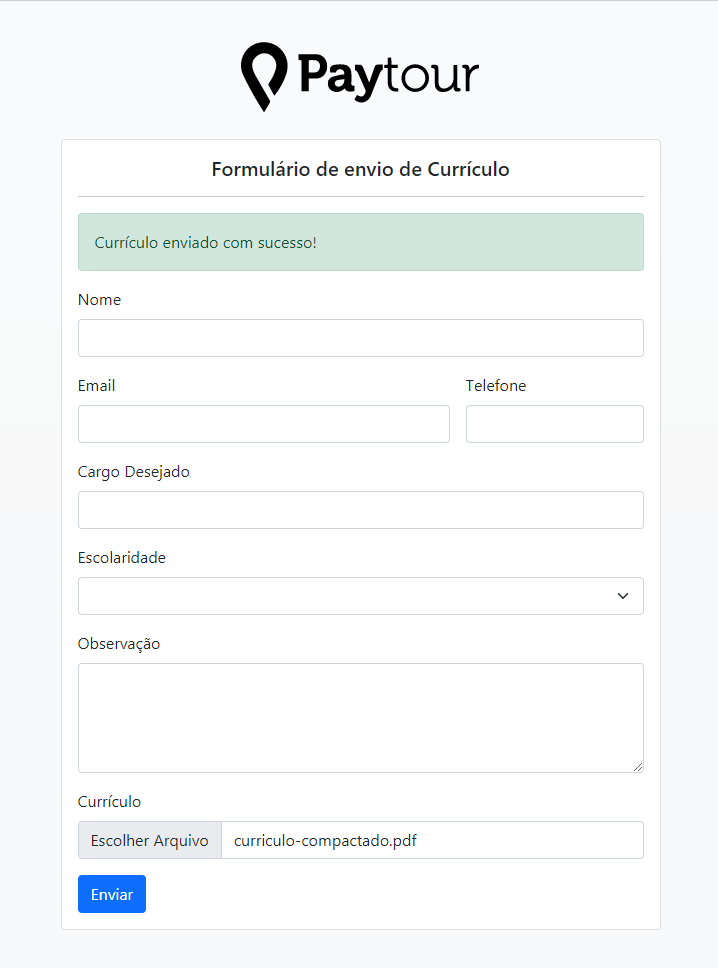

<div align="center">
  <sub>O <strong>ResumeSend</strong> foi desenvolvido com ❤︎ pelo
    <a href="https://github.com/hecktorvn">Hecktor Viegas</a>
  </sub>
</div>

## :page_with_curl: Sobre o Projeto

O Projeto é um formulário de envio de currículo solicitado pela Paytour para seu teste de seleção.

<br>

<p align="center">
  
</p>

# :computer: Tecnologias

Tecnologias e ferramentas utilizadas no desenvolvimento do projeto:

- [Laravel](https://laravel.com/)
- [Livewire](https://laravel-livewire.com/)
- [Bootstrap](https://getbootstrap.com/)

<br>

# :construction_worker: Instalação e uso
Configure o arquivo .env, 
Logo após siga os passos abaixo

```bash
# Abra um terminal e copie este repositório com o comando
git clone https://github.com/hecktorvn/Paytour-formulario-curriculo.git
# ou use a opção de download.

# Entre na pasta web com 
cd Paytour-formulario-curriculo

# Instale as dependências
compser install

# Gere a chave
php artisan key:generate

# Rode o aplicação
php artisan serve

# Acesse http://localhost:8000 no seu navagador.
```

<br>

# :closed_book: Licença
Esse projeto está sob a licença MIT. Veja o arquivo [LICENSE](/LICENSE) para mais detalhes.

---

<div align="center">
  Feito com :purple_heart: by [Hecktor Viegas](https://github.com/hecktorvn) 
</div>
